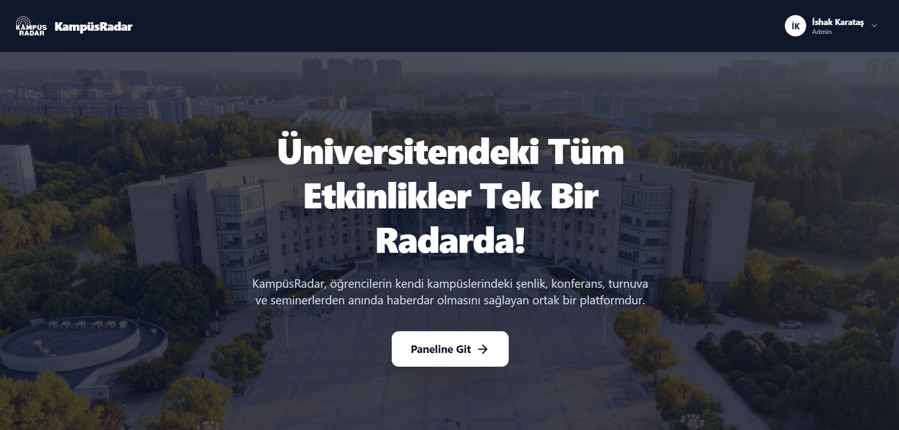
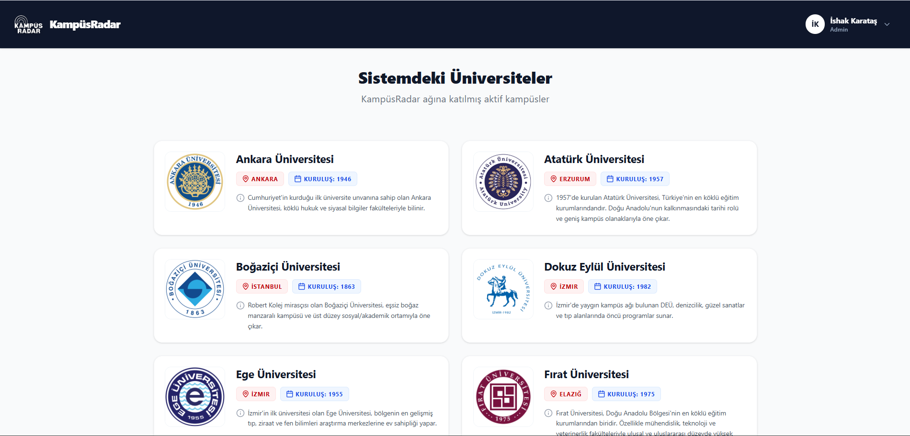

# KampüsRadar

  

`KampüsRadar`, öğrencilerin kendi üniversitelerindeki tüm etkinliklerden (şenlik, konferans, seminer, yarışma, turnuva vb.) tek bir platform üzerinden anında haberdar olmasını sağlayan modern bir uygulamadır. Çevredeki ve diğer üniversitelerdeki etkinlikleri keşfetmeyi kolaylaştırarak kampüs ekosistemini canlandırmayı amaçlar.

---

## 📸 Ekran Görüntüleri

Projenizin ekran görüntülerini görmek ve sergilemek için dosyaları `docs/screenshots/` klasörüne yerleştirebilirsiniz:

| Landing Sayfası - Üst Kısım | Landing Sayfası - Alt Kısım / Üniversiteler |
| :---: | :---: |
|  |  |
